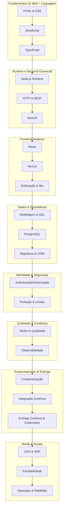

# Roadmap de Estudos Fullstack Robusto

Este roteiro de estudos foi construído com base na estrutura de oito blocos do programa “Tutor Fullstack Robusto” incluído no arquivo ZIP. O plano original enfatiza que os fundamentos vêm antes dos frameworks e que os blocos são sequenciais e cumulativos – cada etapa prepara terreno para a próxima. Para apoiar a jornada, usamos referências atualizadas do mercado que destacam a importância de dominar HTML/CSS, JavaScript/TypeScript, Node.js e HTTP, bancos de dados relacionais, identidade e segurança, qualidade em produção e entrega contínua.

## Como usar este roadmap

- **Siga a ordem dos blocos:** não pule etapas. Os fundamentos de HTML, CSS e JavaScript são necessários antes de trabalhar com React, Node ou bancos de dados.
- **Use sessões curtas e constantes:** reserve de 15 a 45 minutos por sessão, de 3 a 5 vezes por semana. Revise o conteúdo após 24–72 h para fixação.
- **Pratique com projetos:** construa pequenos projetos (formulários, APIs básicas, interfaces React) para aplicar o que aprender. Conectar teoria e prática acelera a curva de aprendizado.
- **Revise e ajuste o ritmo:** este roteiro sugere durações médias; adapte conforme sua disponibilidade e progresso.

## Bloco 1 — Fundamentos da Web + Linguagem (8–12 semanas)

### Objetivo

Compreender como o navegador interpreta documentos, dominar o comportamento do JavaScript e introduzir disciplina com TypeScript. O artigo “The Complete Full‑Stack Developer Roadmap for 2026” lembra que HTML e CSS não são triviais e que a semântica, o box model e a responsividade são fundamentais. A mesma fonte reforça que investir nos fundamentos paga dividendos compostos, pois frameworks mudam mas o protocolo HTTP e o event loop permanecem.

### Etapas sugeridas

- **HTML/CSS (4 semanas):** estrutura do documento, tags semânticas, hierarquia e formulários; CSS box model, display, flexbox, grid, posicionamento e media queries.
- **JavaScript (4 semanas):** tipos, variáveis (let/const), funções e arrow functions, escopo léxico, closures, this, assincronia (callbacks, promises, async/await) e módulos.
- **TypeScript (2 a 4 semanas):** tipos primitivos e complexos, any vs unknown, inferência, interfaces e tipos, generics, união/interseção e tipos opcionais.

### Resultados esperados

- Ser capaz de ler e construir páginas sem depender de frameworks, compreender o fluxo de execução do JavaScript e usar o TypeScript para documentar contratos.

## Bloco 2 — Runtime e Backend Essencial (8–10 semanas)

### Objetivo

Ver o Node.js como um runtime com responsabilidades próprias, entender HTTP e criar APIs organizadas com NestJS. A referência de mercado recomenda iniciar o backend com Node.js/TypeScript para reduzir carga cognitiva e porque o ecossistema é maduro. Também salienta que é essencial compreender as regras do HTTP e as melhores práticas de APIs antes de utilizar frameworks.

### Etapas sugeridas

- **Node.js (3 a 4 semanas):** arquitetura do runtime (V8, event loop, APIs nativas), sistema de módulos, process e variáveis de ambiente, file system (fs), streams, sinais e shutdown gracioso, dependências com npm.
- **HTTP e REST (2 a 3 semanas):** métodos (GET, POST, PUT, PATCH, DELETE), status codes, cabeçalhos importantes, cookies e sessões, CORS e cache, princípios de REST e idempotência. Não trate o backend apenas como proxy de banco de dados; implemente lógica de domínio, validação e autorização.
- **NestJS (3 semanas):** arquitetura modular, controllers, services, providers, injeção de dependência, DTOs, pipes, guards, interceptors e filtros de exceção. Evite copiar código sem entender; separe camadas de domínio e infraestrutura.

### Resultados esperados

- Explicar o papel do Node como runtime, descrever o ciclo completo de uma requisição HTTP e criar uma API organizada com NestJS.

## Bloco 3 — Frontend Moderno (8–10 semanas)

### Objetivo

Aprender a construir interfaces ricas com React e Next.js. O mesmo artigo enfatiza que React é dominante em 2026 mas não é mágico; entender componentes, props, estado e ciclo de vida torna mais fácil transitar entre bibliotecas.

### Etapas sugeridas

- **React (4 semanas):** componentes e composição, props vs estado, hooks (useState, useEffect, useContext), ciclo de renderização, manipulação de eventos e componentes controlados. Comece sem bibliotecas de estado externas; use context e hooks antes de recorrer a Redux ou Zustand.
- **Next.js (2 semanas):** roteamento baseado em arquivos, páginas e rotas dinâmicas, data fetching (getStaticProps, getServerSideProps), server‑side rendering, static site generation e API routes. Entenda o que o framework abstrai em vez de tratá‑lo como mágica.
- **Estilização e frameworks (2 semanas):** aprofunde‑se em CSS; depois experimente Tailwind, Material UI ou Chakra UI para acelerar o desenvolvimento. Use bibliotecas de componentes como ferramenta de produtividade e não substituto de entendimento.

### Resultados esperados

- Criar aplicações React e Next.js com componentes reutilizáveis, roteamento estruturado e data fetching apropriado.

## Bloco 4 — Dados e Persistência (4–6 semanas)

### Objetivo

Dominar modelagem de dados, SQL e o uso do PostgreSQL. O glossário do Databricks define o PostgreSQL como um banco de dados relacional open‑source que armazena, organiza e recupera dados estruturados, mantendo a integridade mesmo com múltiplos usuários. O artigo de referência recomenda preferir SQL (PostgreSQL, MySQL) para a maioria dos casos e usar NoSQL apenas quando houver motivo específico.

### Etapas sugeridas

- **Modelagem relacional (1 a 2 semanas):** entender entidades, relacionamentos, chaves primárias e estrangeiras, normalização e planejamento de esquemas. Pense nas consultas que precisará executar.
- **SQL e PostgreSQL (2 semanas):** comandos CRUD, filtros (WHERE), ordenação, joins, funções agregadas, subconsultas, transações e locks. Explore particularidades do PostgreSQL como tipos avançados, extensões e JSON. Uma pesquisa do Stack Overflow aponta que 49 % dos desenvolvedores usam PostgreSQL e grandes empresas (Apple, Instagram, Spotify) rodam-no em produção.
- **Migrations e ORM (1 a 2 semanas):** aprenda ferramentas de migração (Prisma, TypeORM, Knex) e ORMs para manter a evolução do banco sob controle. Escreva migrations reversíveis e atômicas.

### Resultados esperados

- Projetar esquemas de banco de dados consistentes, escrever consultas eficientes e manter mudanças de esquema versionadas.

## Bloco 5 — Identidade, Segurança e Limites (4–6 semanas)

### Objetivo

Implementar autenticação, autorização e segurança de API de forma responsável. A referência alerta que muitos desenvolvedores têm dificuldade aqui e que erros possuem implicações graves.

### Conteúdos essenciais

- **Autenticação vs Autorização:** entender a diferença entre “quem é você?” e “o que você pode fazer?”; estudar sessões vs tokens, JWT, OAuth 2.0 e OpenID Connect.
- **Armazenamento seguro de senhas:** hashing com bcrypt ou argon2, políticas de senhas e proteção contra ataques de força bruta.
- **Proteção de APIs:** rate limiting, CORS, cabeçalhos de segurança, validação e sanitização de entrada, prevenção de CSRF e XSS.
- **Uso de provedores de identidade:** considerar Auth0, Clerk ou Supabase para reduzir riscos e acelerar o desenvolvimento.

### Resultados esperados

- Escolher e implementar mecanismos de autenticação adequados, aplicar autorizações de forma consistente e adotar práticas de segurança em toda a stack.

## Bloco 6 — Qualidade e Confiança em Produção (4–6 semanas)

### Objetivo

Garantir que o código seja confiável, testável e observável. O guia de CI/CD para Node.js ressalta que testes automatizados, linting e análise de vulnerabilidades são parte de um pipeline profissional.

### Conteúdos essenciais

- **Testes (2 semanas):** testes unitários e de integração (Jest, Vitest, Supertest), testes de interface (Cypress, Playwright). Escrever casos de sucesso e falha e automatizar via CI.
- **Qualidade de código (1 semana):** uso de ESLint, Prettier e commit hooks; revisão de código; análise de cobertura e métricas de qualidade.
- **Observabilidade (1 a 2 semanas):** logs estruturados, métricas, traces e alertas. Implementar health checks e graceful shutdown; usar ferramentas como Sentry, Datadog ou Prometheus para monitorar.

### Resultados esperados

- Incorporar testes em cada camada da aplicação, automatizar verificações de qualidade no pipeline e monitorar sistemas em produção.

## Bloco 7 — Empacotamento e Entrega (4–6 semanas)

### Objetivo

Aprender a construir e entregar aplicações de forma consistente usando Docker, Git e CI/CD. O guia de pipeline completo demonstra como criar uma aplicação Node.js, automatizar testes, construir imagens Docker e implantar com Kubernetes.

### Conteúdos essenciais

- **Containerização (1 a 2 semanas):** construir imagens multi‑stage, executar aplicações como usuário não‑root, configurar health checks e sinalização adequada.
- **Integração Contínua (1 semana):** configurar repositórios Git, ações de CI, rodar testes e lint em cada push, escanear imagens e enviar para registries.
- **Entrega Contínua (1 a 2 semanas):** escrever manifests do Kubernetes, configurar réplicas, liveness/readiness probes e limitar recursos; separar fluxos de staging e produção e utilizar GitOps quando possível.

### Resultados esperados

- Empacotar aplicações de maneira reprodutível, automatizar a entrega de código e executar deploys confiáveis em ambientes controlados.

## Bloco 8 — Borda, Escala e Operação (4–6 semanas)

### Objetivo

Compreender como escalar e operar aplicações em produção, usando CDN, WAF, auto‑scaling e observabilidade avançada.

### Conteúdos essenciais

- **CDN e WAF (1 semana):** estudar Content Delivery Networks, cache de conteúdo estático/dinâmico, proteção de borda e Web Application Firewalls.
- **Escalabilidade horizontal (1 a 2 semanas):** utilizar Kubernetes para replicar serviços, configurar autoscalers, estudar balanceamento de carga e service meshes. O guia de pipeline mostra como configurar réplicas e limites de recursos para ambientes de staging e produção.
- **Operação contínua (1 a 2 semanas):** monitoramento centralizado, rotinas de incidentes, backups e estratégia de disaster recovery. Aprender a analisar métricas para ajustar escala e custo.

### Resultados esperados

- Planejar e operar sistemas resilientes, protegidos por camadas de segurança na borda e capazes de escalar com demanda.

## Cronograma resumido

O arquivo timeline.txt deste diretório apresenta uma sugestão de cronograma semana a semana, distribuindo os blocos ao longo de cerca de 60 semanas. Ajuste conforme seu ritmo.

## Conclusão

Ser fullstack robusto é dominar tanto o front‑end quanto o back‑end, bem como as práticas de DevOps e operação. Aprender HTML/CSS a fundo, entender JavaScript antes de usar frameworks e compreender APIs e bancos de dados são investimentos que rendem ao longo de toda a carreira. Use este roadmap como guia, mas lembre‑se de que a aprendizagem real ocorre ao resolver problemas e construir projetos — faça, quebre, conserte e aprenda.

## Mapa visual (Mermaid)

## Cronograma detalhado (60 semanas)

### Semana 01–04 · Bloco 1 — HTML/CSS
- Estude a estrutura básica de documentos HTML.
- Aprenda tags semânticas, formulários, hierarquia de elementos.
- Domine o box model, propriedades de display, flexbox e grid, posicionamento e media queries.

### Semana 05–08 · Bloco 1 — JavaScript
- Revise tipos primitivos, variáveis (let/const) e funções.
- Pratique escopo léxico, closures, `this` e módulos.
- Estude assincronia com callbacks, promises e `async/await`.

### Semana 09–12 · Bloco 1 — TypeScript
- Explore tipos primitivos, inferência, interfaces, `type` e generics.
- Aprenda sobre `any` vs `unknown` e tipos opcionais.
- Reescreva pequenos scripts JS em TS para reforçar o uso de tipos.

### Semana 13–15 · Bloco 2 — Node.js
- Entenda a composição do Node (V8, event loop, APIs nativas).
- Use o sistema de módulos, leia arquivos com `fs`, trabalhe com streams e variáveis de ambiente.
- Crie scripts CLI simples e servidores HTTP sem frameworks.

### Semana 16–18 · Bloco 2 — HTTP e REST
- Revise métodos HTTP e seus usos (GET, POST, PUT, PATCH, DELETE).
- Estude status codes, cabeçalhos, cookies, CORS e cache.
- Implemente endpoints REST puros e trate erros adequadamente.

### Semana 19–22 · Bloco 2 — NestJS
- Aprenda a estrutura de um projeto Nest (modules, controllers, services).
- Adicione DTOs, validação, pipes, guards e interceptors.
- Construa uma API CRUD organizada e implemente autenticação simples.

### Semana 23–26 · Bloco 3 — React
- Crie componentes e entenda composição.
- Trabalhe com props, estado e hooks (`useState`, `useEffect`, `useContext`).
- Construa pequenos aplicativos (todo list, galeria) para fixar conceitos.

### Semana 27–28 · Bloco 3 — Next.js
- Explore roteamento baseado em arquivos e rotas dinâmicas.
- Experimente SSR, SSG e API routes.
- Pratique data fetching com `getStaticProps` e `getServerSideProps`.

### Semana 29–30 · Bloco 3 — Estilização e frameworks
- Aprofunde seus conhecimentos de CSS sem frameworks.
- Experimente Tailwind, Material UI ou Chakra UI em projetos React.
- Compare as abordagens e escolha a mais produtiva para seu estilo.

### Semana 31–32 · Bloco 4 — Modelagem de dados
- Aprenda conceitos de modelagem relacional (entidades, relacionamentos, normalização).
- Desenhe o esquema de um projeto simples, como blog ou e‑commerce.
- Pense nas consultas que precisará executar para validar o modelo.

### Semana 33–34 · Bloco 4 — SQL e PostgreSQL
- Execute comandos CRUD, filtros, joins e agregações.
- Experimente transações, constraints e índices.
- Explore extensões do PostgreSQL, tipos JSON e funções avançadas.

### Semana 35–36 · Bloco 4 — Migrations e ORM
- Escolha uma ferramenta (Prisma, TypeORM, Knex) e crie migrations.
- Faça evoluções reversíveis no esquema de dados.
- Integre o ORM com sua API Nest ou script Node.

### Semana 37–38 · Bloco 5 — Autenticação e Autorização
- Diferencie autenticação de autorização.
- Implemente login com sessões, tokens JWT e refresh tokens.
- Experimente provedores como Auth0 ou Supabase Auth.

### Semana 39–40 · Bloco 5 — Segurança Aplicada
- Armazene senhas com hashing (bcrypt/argon2) e configure política de senhas.
- Aplique CORS, rate limiting, cabeçalhos de segurança e validação de entrada.
- Proteja contra CSRF, XSS e injeção de SQL.

### Semana 41–42 · Bloco 5 — Limites e autorização avançada
- Implemente RBAC (Role‑Based Access Control) ou ABAC.
- Adicione permissões por recurso e registre logs de acesso.
- Revise e teste fluxos de logout e renovação de token.

### Semana 43–44 · Bloco 6 — Testes
- Escreva testes unitários e de integração para suas APIs e componentes React.
- Crie testes de interface com Cypress ou Playwright.
- Configure coverage e integre os testes ao CI.

### Semana 45 · Bloco 6 — Qualidade de código
- Configure ESLint e Prettier.
- Adote convenções de commit e utilize commit hooks.
- Faça revisões de código com foco em legibilidade e consistência.

### Semana 46–47 · Bloco 6 — Observabilidade
- Adicione logs estruturados com contexto (requisição, usuário, correlação).
- Exponha métricas (HTTP, base de dados, filas) e colete-as com Prometheus ou Grafana.
- Configure alertas e ferramentas como Sentry para erros.

### Semana 48–49 · Bloco 7 — Containerização
- Escreva Dockerfiles multi‑stage e otimize o tamanho das imagens.
- Utilize Docker Compose para rodar serviços localmente.
- Garanta que o container lide com sinais e finalize processos corretamente.

### Semana 50 · Bloco 7 — Integração Contínua
- Crie repositório Git e configure GitHub Actions.
- Automatize testes, linting e build em cada push.
- Escaneie imagens para vulnerabilidades e gere artefatos.

### Semana 51–53 · Bloco 7 — Entrega Contínua e Kubernetes
- Escreva manifests do Kubernetes (Deployment, Service, Ingress).
- Defina réplicas, limites de CPU/memória e probes de liveness/readiness.
- Configure ambientes de staging e produção e implemente estratégias de deploy (blue/green, rolling update).

### Semana 54 · Bloco 7 — Fluxo de produção
- Separe branches e pipelines para staging e produção.
- Implemente rollback automático em caso de falha.
- Documente seu pipeline e compartilhe com colegas.

### Semana 55 · Bloco 8 — CDN e WAF
- Estude como uma CDN distribui conteúdo globalmente e reduz latência.
- Configure cache para recursos estáticos e dinâmicos.
- Pesquise soluções de WAF e entenda regras básicas de proteção.

### Semana 56–57 · Bloco 8 — Escala e auto‑scaling
- Configure Horizontal Pod Autoscaler no Kubernetes.
- Analise métricas para definir thresholds de escalabilidade.
- Teste balanceamento de carga e explore service meshes (Istio, Linkerd).

### Semana 58–59 · Bloco 8 — Operação e confiabilidade
- Planeje backups regulares e recovery.
- Defina processos de incidentes e comunicação.
- Otimize custos ajustando réplicas e recursos conforme demanda.

### Semana 60 · Projeto integrador e revisão
- Integre todas as competências construindo um projeto completo (API + frontend + banco + CI/CD + deploy).
- Documente arquitetura, decisões e resultados.
- Revise os blocos anteriores, identifique lacunas e planeje ciclos de aprendizado contínuo.
