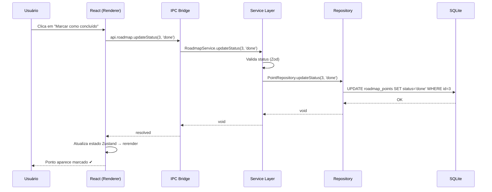

# Backend — Planejamento

## Tecnologias Usadas

| Tecnologia | Função |
|---|---|
| **TypeScript** | Linguagem principal do backend |
| **Electron Main Process** | Processo Node.js nativo que roda no desktop |
| **better-sqlite3** | Driver SQLite síncrono (sem servidor) |
| **IPC (Electron)** | Canal de comunicação entre UI (renderer) e lógica (main) |
| **Zod** | Validação de schemas em runtime |
| **electron-store** | Persistência de configurações simples (JSON) |

> **Arquitetura:** Como o app é off-line e desktop, não existe servidor HTTP separado. O "backend" é o **Electron Main Process** — um processo Node.js que roda junto com o app e se comunica com o frontend via **IPC (Inter-Process Communication)**.

---

## Principais Funções e Como Interagem

### Camadas da Arquitetura Backend

```
Renderer (React)
    │  ipcRenderer.invoke('channel', payload)
    ▼
IPC Handler Layer     ← ponto de entrada, mapeia canais para services
    │
    ▼
Service Layer         ← lógica de negócio pura
    │
    ▼
Repository Layer      ← acesso ao banco (SQL com better-sqlite3)
    │
    ▼
SQLite Database (studyapp.db)
```

---

### IPC Handler Layer

Registra os canais IPC e delega para os serviços:

```typescript
// ipc/roadmapHandlers.ts
ipcMain.handle('roadmap:getAll', () => RoadmapService.getAll())
ipcMain.handle('roadmap:updateStatus', (_, id, status) =>
  RoadmapService.updateStatus(id, status))

// ipc/noteHandlers.ts
ipcMain.handle('notes:getByPoint', (_, pointId) => NoteService.getByPoint(pointId))
ipcMain.handle('notes:save', (_, payload) => NoteService.save(payload))

// ipc/studyHandlers.ts
ipcMain.handle('studies:getByPoint', (_, pointId) => StudyService.getByPoint(pointId))

// ipc/activityHandlers.ts
ipcMain.handle('activities:getByPoint', (_, pointId) => ActivityService.getByPoint(pointId))
ipcMain.handle('activities:toggle', (_, id) => ActivityService.toggle(id))
```

---

### Service Layer

Contém a lógica de negócio. Cada serviço é uma classe com métodos puros que recebem e devolvem objetos tipados.

#### `RoadmapService`

| Método | Entrada | Saída | Descrição |
|---|---|---|---|
| `getAll()` | — | `Block[]` | Retorna todos os blocos com seus pontos |
| `getBlock(id)` | `blockId: number` | `Block` | Retorna um bloco específico |
| `getPoint(id)` | `pointId: number` | `RoadMapPoint` | Retorna um ponto com status |
| `updateStatus(id, status)` | `pointId, StatusEnum` | `void` | Muda o status de um ponto |
| `getProgress()` | — | `ProgressSummary` | % concluído geral e por bloco |

#### `NoteService`

| Método | Entrada | Saída | Descrição |
|---|---|---|---|
| `getByPoint(pointId)` | `number` | `Note` \| `null` | Retorna nota do ponto |
| `save(payload)` | `{pointId, content}` | `Note` | Cria ou atualiza nota |
| `getAll()` | — | `Note[]` | Todas as notas (para busca) |
| `delete(id)` | `noteId: number` | `void` | Remove nota |

#### `StudyService`

| Método | Entrada | Saída | Descrição |
|---|---|---|---|
| `getByPoint(pointId)` | `number` | `Study[]` | Lista estudos do ponto |
| `add(payload)` | `{pointId, title, url?}` | `Study` | Adiciona material de estudo |
| `remove(id)` | `number` | `void` | Remove material |

#### `ActivityService`

| Método | Entrada | Saída | Descrição |
|---|---|---|---|
| `getByPoint(pointId)` | `number` | `Activity[]` | Lista atividades do ponto |
| `add(payload)` | `{pointId, description}` | `Activity` | Adiciona atividade |
| `toggle(id)` | `number` | `Activity` | Marca/desmarca conclusão |
| `remove(id)` | `number` | `void` | Remove atividade |

---

### Repository Layer

Camada de acesso a dados — cada repositório executa SQL diretamente:

```typescript
// repositories/PointRepository.ts
export class PointRepository {
  static findAll(): RoadMapPointRow[] {
    return db.prepare('SELECT * FROM roadmap_points ORDER BY block_id, order_index').all()
  }

  static updateStatus(id: number, status: string): void {
    db.prepare('UPDATE roadmap_points SET status = ? WHERE id = ?').run(status, id)
  }
}
```

---

## Interação Backend ↔ Frontend

O frontend **nunca** acessa o banco diretamente. Toda comunicação passa pelo IPC:

```
[React Component]
  │
  ├─ import { api } from '../lib/api'    ← wrapper sobre ipcRenderer
  │
  ├─ api.roadmap.getAll()
  │    └─ ipcRenderer.invoke('roadmap:getAll')
  │              │
  │              ▼  (cruzamento do boundary renderer → main)
  │         ipcMain.handle('roadmap:getAll', ...)
  │              │
  │              ▼
  │         RoadmapService.getAll()
  │              │
  │              ▼
  │         PointRepository.findAll()  ← SQL
  │              │
  │              ▼  (retorno sobe a cadeia)
  └─ recebe Block[]
```

### Módulo `api.ts` (frontend)

Centraliza todas as chamadas IPC com tipagem:

```typescript
// src/renderer/lib/api.ts
export const api = {
  roadmap: {
    getAll: () => ipcRenderer.invoke('roadmap:getAll') as Promise<Block[]>,
    updateStatus: (id: number, status: Status) =>
      ipcRenderer.invoke('roadmap:updateStatus', id, status),
    getProgress: () => ipcRenderer.invoke('roadmap:getProgress') as Promise<ProgressSummary>,
  },
  notes: {
    getByPoint: (pointId: number) => ipcRenderer.invoke('notes:getByPoint', pointId),
    save: (pointId: number, content: string) => ipcRenderer.invoke('notes:save', { pointId, content }),
  },
  // ... estudos, atividades
}
```

---

## Interação Backend ↔ Banco de Dados

`better-sqlite3` é síncrono — todas as operações são síncronas no processo main, o que simplifica o código e evita problemas de concorrência (app single-user).

```
RoadmapService.updateStatus(id, 'done')
  └─ PointRepository.updateStatus(id, 'done')
       └─ db.prepare('UPDATE ...').run(status, id)
            └─ [SQLite file: studyapp.db]   [escrita em disco]
```

Inicialização do banco:
```typescript
// main/db/database.ts
import Database from 'better-sqlite3'
const db = new Database(path.join(app.getPath('userData'), 'studyapp.db'))
db.exec(fs.readFileSync('schema.sql', 'utf8'))  // cria tabelas se não existirem
export default db
```

---

## Diagrama de Interação


