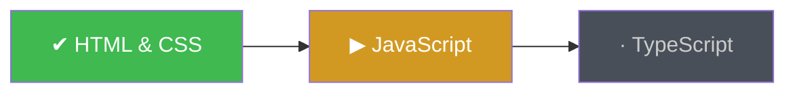
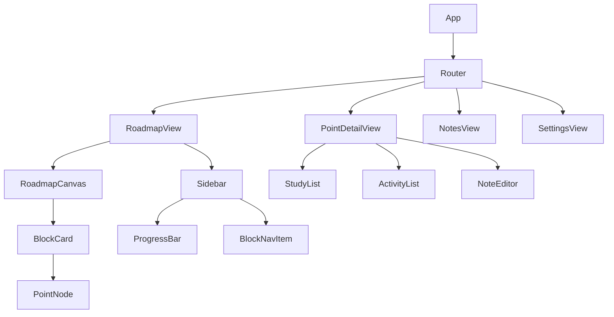

# Frontend — Planejamento

## Tecnologias Usadas

| Tecnologia | Função |
|---|---|
| **React 18** | Biblioteca de UI (componentes, estado, hooks) |
| **TypeScript** | Tipagem estática em todo o projeto |
| **Electron** | Empacotamento desktop off-line (janela nativa) |
| **Vite** | Bundler/devserver para o código React |
| **React Router v6** | Roteamento SPA entre as views |
| **Zustand** | Gerenciamento de estado global leve |
| **Framer Motion** | Animações e micro-interações |
| **CodeMirror 6** | Editor de texto para notas (Markdown) |
| **Lucide React** | Ícones consistentes |

> **Por que Electron?** O requisito é off-line. Electron permite empacotar o app como executável nativo (.exe) sem depender de servidor externo.

---

## Cores de Base

Paleta escura/minimalista inspirada em ferramentas como Obsidian e Linear:

```
--color-bg-app:        #0F1117   /* fundo principal */
--color-bg-sidebar:    #161B22   /* sidebar */
--color-bg-panel:      #1C2128   /* painéis e cards */
--color-bg-hover:      #21262D   /* hover de itens */
--color-border:        #30363D   /* bordas suaves */

--color-accent:        #58A6FF   /* azul primário (ações, foco ativo) */
--color-accent-green:  #3FB950   /* progresso / status "done" */
--color-accent-yellow: #D29922   /* status "in_progress" */
--color-accent-muted:  #484F58   /* status "pending" / desabilitado */

--color-text-primary:  #E6EDF3   /* texto principal */
--color-text-secondary:#8B949E   /* texto secundário / labels */
--color-text-link:     #58A6FF   /* links e ações */

--font-sans: 'Inter', system-ui, sans-serif
--font-mono: 'JetBrains Mono', monospace
```

---

## Layout das Páginas

O app é **single-window** com layout tripartido:

```
┌──────────────────────────────────────────────────────┐
│  TitleBar (Electron custom titlebar)                 │
├──────────┬───────────────────────────┬───────────────┤
│          │                           │               │
│ Sidebar  │    Workspace              │  Detail Pane  │
│ (240px)  │    (flex grow)            │  (360px)      │
│          │                           │  (oculto por  │
│          │                           │   padrão)     │
│          │                           │               │
└──────────┴───────────────────────────┴───────────────┘
│  StatusBar (progresso geral)                         │
└──────────────────────────────────────────────────────┘
```

### Páginas/Views (React Router)

| Rota | Componente | Descrição |
|---|---|---|
| `/` | `RoadmapView` | Roadmap visual principal |
| `/block/:blockId` | `BlockView` | Detalhe de um bloco expandido |
| `/point/:pointId` | `PointDetailView` | Estudos + Atividades + Notas de um ponto |
| `/notes` | `NotesView` | Lista e busca de todas as notas |
| `/settings` | `SettingsView` | Configurações do app |

---

## Design dos Blocos de Interação

### Sidebar

```
┌───────────────────────────┐
│  🗺️  StudyApp        [⚙]  │
├───────────────────────────┤
│  Progresso Geral          │
│  ████████░░░░  42%        │
├───────────────────────────┤
│  ROADMAP                  │
│  ▸ Bloco 1 · Fundamentos  │  ← ativo (expandido)
│    ○ HTML & CSS      ✔    │
│    ○ JavaScript      ▶    │  ← in_progress
│    ○ TypeScript      ·    │
│  ▸ Bloco 2 · Backend      │
│  ▸ Bloco 3 · Frontend     │
│  ▸ Bloco 4 · Dados        │
│  ▸ Bloco 5 · Segurança    │
│  ▸ Bloco 6 · Qualidade    │
│  ▸ Bloco 7 · Entrega      │
│  ▸ Bloco 8 · Escala       │
├───────────────────────────┤
│  📝 Notas                 │
│  ⚙️  Configurações         │
└───────────────────────────┘
```

**Comportamento:**
- Clique no bloco → expande lista de pontos
- Ícone de status: `✔` done · `▶` in_progress · `·` pending
- Clique no ponto → navega para `PointDetailView`

---

### Workspace — RoadmapView

Exibe o mapa visual usando um diagrama de nós. Cada bloco é um card expansível com seus pontos internos. O status de cada ponto é exibido por cor:



Controles no topo do workspace:

```
[Vista: Mapa | Lista]   [Filtrar: Todos | Pendente | Em andamento | Concluído]   [🔍 Buscar]
```

---

### Workspace — PointDetailView

Estrutura do painel de detalhe de um RoadMapPoint:

```
┌─────────────────────────────────────────────────┐
│  ← Voltar    Bloco 1 › JavaScript               │
│  Status: [ Pendente ▾ ]    Semanas 05–08         │
├─ 📚 ESTUDOS ────────────────────────────────────┤
│  • Tipos primitivos, variáveis, funções          │
│  • Closures e escopo léxico                      │
│  • Promises e async/await          [+ Adicionar] │
├─ ✏️ ATIVIDADES ─────────────────────────────────┤
│  ☐ Reescrever função com arrow function          │
│  ☑ Criar promise encadeada         [+ Adicionar] │
├─ 📝 NOTAS ──────────────────────────────────────┤
│  ┌──────────────────────────────────────────┐   │
│  │ Editor Markdown (CodeMirror)             │   │
│  │ ...nota do usuário aqui...               │   │
│  └──────────────────────────────────────────┘   │
│                              [Salvar nota]       │
└─────────────────────────────────────────────────┘
```

---

### StatusBar

Barra fixa no rodapé mostrando:
```
Bloco atual: 1 · Fundamentos    |    Pontos concluídos: 1/3    |    Progresso total: 3/24
```

---

## Diagrama de Componentes


