# StudyApp — Visão Geral do Projeto

> Aplicativo **off-line** de apoio ao estudo fullstack, baseado no currículo de 8 blocos do Tutor Fullstack Robusto (JS/TS).

---

## Objetivo

Criar um aplicativo desktop/web local que:

- Exibe um **Roadmap visual e marcável** com os 8 blocos e seus pontos internos.
- Permite acessar, a partir de cada ponto do roadmap, os **Estudos**, **Atividades** e **Notas do usuário** relacionados.
- Funciona completamente **off-line**, sem depender de nenhum serviço externo.

---

## Estrutura do Roadmap (Blocos do Currículo)

```
Bloco 1 — Fundamentos da Web + Linguagem (HTML/CSS → JS → TS)
Bloco 2 — Runtime e Backend Essencial (Node.js → HTTP/REST → NestJS)
Bloco 3 — Frontend Moderno (React → Next.js → Estilização)
Bloco 4 — Dados e Persistência (Modelagem → PostgreSQL → ORM/Migrations)
Bloco 5 — Identidade, Segurança e Limites (Auth → Proteção → RBAC)
Bloco 6 — Qualidade e Confiança em Produção (Testes → Qualidade → Observ.)
Bloco 7 — Empacotamento e Entrega (Docker → CI → CD/K8s)
Bloco 8 — Borda, Escala e Operação (CDN/WAF → Escala → Reliability)
```

Cada ponto no roadmap é um **RoadMapPoint** com:

| Campo | Descrição |
|---|---|
| `id` | Identificador único |
| `title` | Nome do tópico |
| `block` | Bloco pai (1–8) |
| `status` | `pending` / `in_progress` / `done` |
| `studies` | Lista de materiais de estudo vinculados |
| `activities` | Lista de atividades/exercícios vinculados |
| `notes` | Lista de notas pessoais do usuário |

---

## Documentos de Planejamento

| Seção | Arquivo |
|---|---|
| Frontend | [frontend/frontend.md](./frontend/frontend.md) |
| Backend | [backend/backend.md](./backend/backend.md) |
| Armazenamento | [storage/storage.md](./storage/storage.md) |
| Rotas e Fluxos | [routes-and-flows/routes-and-flows.md](./routes-and-flows/routes-and-flows.md) |
| Extras | [extras/extras.md](./extras/extras.md) |

---

## Diagrama de Alto Nível

```mermaid
flowchart LR
    subgraph UI["Interface (React + Electron/Browser)"]
        Roadmap["🗺️ Roadmap View\n(marcável)"]
        Detail["📖 Detail View\n(estudos, atividades, notas)"]
        Notes["📝 Notes Editor"]
    end

    subgraph Logic["Lógica de Aplicação (TypeScript)"]
        RoadmapSvc["RoadmapService"]
        StudySvc["StudyService"]
        ActivitySvc["ActivityService"]
        NoteSvc["NoteService"]
    end

    subgraph Storage["Persistência (SQLite via better-sqlite3)"]
        DB[("studyapp.db")]
    end

    Roadmap -->|"navega"| Detail
    Detail -->|"abre"| Notes
    UI --> Logic
    Logic --> Storage
```


