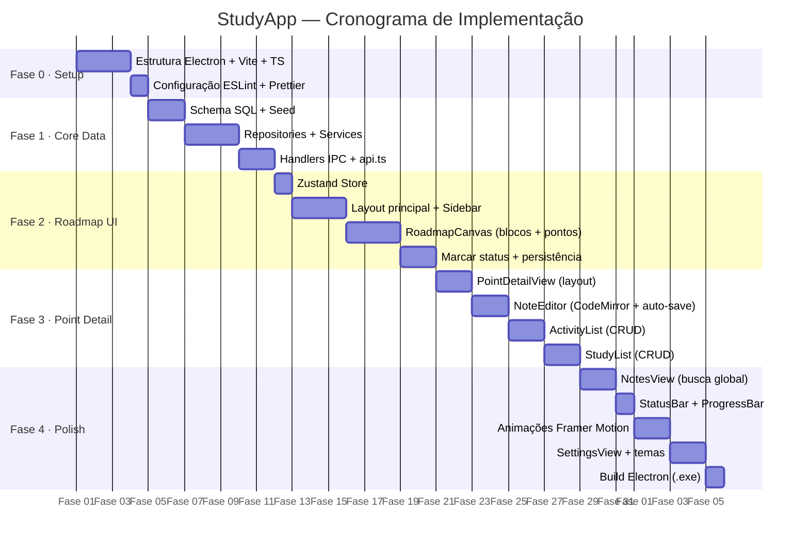

# StudyApp — Planejamento de Implementação

> Guia de implementação passo a passo, dividido em **5 fases** sequenciais e cumulativas.
> Cada fase termina com um app funcional incrementando o anterior.

---

## Fases de Implementação

---

## Mapa de Fases

| Fase | Nome | Entregável Principal | Doc |
|---|---|---|---|
| **0** | Setup & Scaffolding | Projeto Electron + React rodando | [fase-0-setup.md](./fase-0-setup.md) |
| **1** | Core Data Layer | Banco, Services, IPC funcionando | [fase-1-core-data.md](./fase-1-core-data.md) |
| **2** | Roadmap UI | Roadmap visual marcável | [fase-2-roadmap-ui.md](./fase-2-roadmap-ui.md) |
| **3** | Point Detail | Notas + Atividades + Estudos por ponto | [fase-3-point-detail.md](./fase-3-point-detail.md) |
| **4** | Polish & Entrega | Busca, animações, build final | [fase-4-polish.md](./fase-4-polish.md) |

---

## Critério de "Fase Completa"

Cada fase é considerada concluída quando:

1. O código compila sem erros TypeScript
2. O app Electron abre e exibe a feature correspondente sem crashes
3. A persistência funciona: fechar e reabrir o app mantém os dados
4. Nenhuma regressão nas features de fases anteriores

---

## Convenções de Implementação

- **Branch por fase:** `feat/fase-0`, `feat/fase-1`, etc.
- **Commits semânticos:** `feat:`, `fix:`, `chore:`, `refactor:`
- **Tipagem estrita:** `strict: true` no `tsconfig.json`
- **Sem `any`:** usar `unknown` + type guards quando necessário
- **Validação de entrada IPC:** toda payload IPC passa por `Zod.parse()` antes de entrar na service layer
