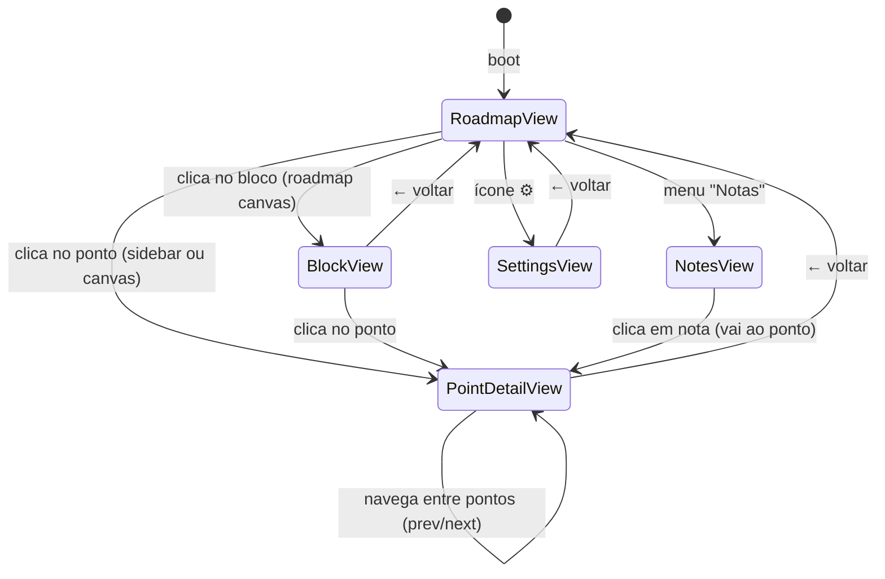
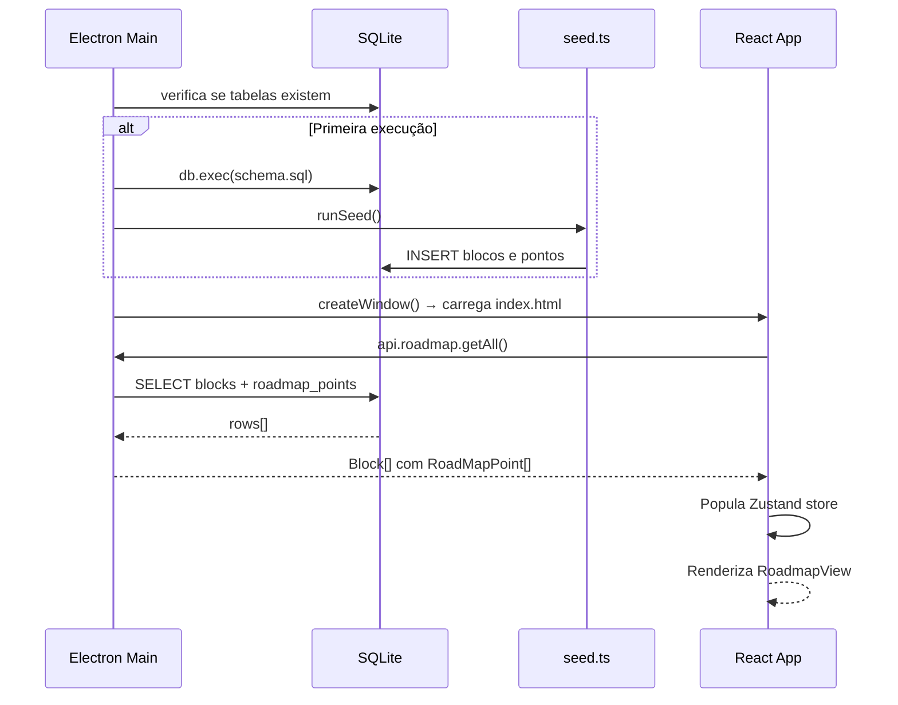
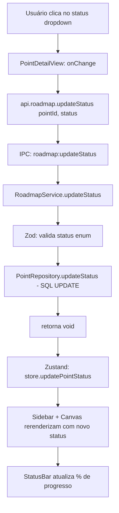
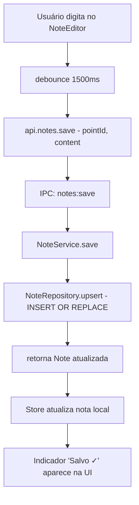

# Rotas e Fluxos de Dados — Planejamento

## Fluxo de Rotas (React Router)

O app é uma SPA dentro do Electron. As rotas são do lado do cliente (hash-based ou memory router para compatibilidade com Electron).

```
/                       → RoadmapView       (roadmap visual + sidebar)
/block/:blockId         → BlockView          (detalhes de um bloco)
/point/:pointId         → PointDetailView   (estudos + atividades + notas)
/notes                  → NotesView          (busca global de notas)
/settings               → SettingsView       (configurações)
```

### Diagrama de Navegação



---

## Fluxo de Dados

### Carregamento Inicial da Aplicação



---

### Fluxo: Atualizar Status de um Ponto



---

### Fluxo: Salvar Nota



---

### Fluxo: Busca Global de Notas

```mermaid
flowchart TD
    A[Usuário digita na NotesView] --> B[debounce 300ms]
    B --> C[api.notes.search - query]
    C --> D[IPC: notes:search]
    D --> E[NoteService.search]
    E --> F[NoteRepository.search\nSELECT ... WHERE content LIKE ?]
    F --> G[Note[] com pointId + pointTitle]
    G --> H[UI exibe lista filtrada]
    H --> I[Clique → navega para /point/:id]
```

---

## Fluxo de Interação Usuário ↔ Sistema

### Mapa Geral de Ações

| Ação do Usuário | Sistema Responde |
|---|---|
| Abre o app | Carrega DB, renderiza roadmap com status persistidos |
| Clica num ponto | Navega para PointDetailView, busca dados do ponto via IPC |
| Muda status do ponto | Persiste no DB, atualiza sidebar + canvas + barra de progresso |
| Digita nota | Debounce → auto-salva via IPC → feedback visual |
| Adiciona atividade | Insert no DB, lista rerenderiza |
| Conclui atividade (checkbox) | Update no DB, visual atualizado instantaneamente |
| Adiciona material de estudo | Insert no DB, lista rerenderiza |
| Busca nas notas | Query LIKE no DB, lista filtrada exibida |
| Altera configuração | electron-store persiste, app aplica imediatamente |

---

## Fluxo de Interação Sistema ↔ Sistema

### Inicialização dos Módulos

```
Electron app.whenReady()
   │
   ├─ DatabaseModule.init()      → abre / cria studyapp.db
   │    └─ MigrationRunner       → aplica migrations pendentes
   │
   ├─ SeedModule.run()           → insere dados base se sessão nova
   │
   ├─ IPCModule.registerAll()    → registra todos os handlers IPC
   │    ├─ roadmapHandlers
   │    ├─ noteHandlers
   │    ├─ studyHandlers
   │    └─ activityHandlers
   │
   └─ createMainWindow()         → carrega React app (renderer)
```

### Fluxo de Atualização Reativa (Zustand)

```
IPC retorna dado
   │
   └─ useRoadmapStore.setState(...)   → estado global atualizado
        │
        ├─ Sidebar (subscrita ao store) → re-renderiza lista de pontos
        ├─ RoadmapCanvas              → re-renderiza status dos nodes
        └─ StatusBar                  → re-renderiza % de progresso
```

> Não há WebSockets nem polling. O estado é atualizado **sincronamente** após cada operação IPC, pois o app é single-user e todas as writes são imediatas (better-sqlite3 síncrono).

---

## Mapa de Canais IPC

```
roadmap:getAll          → RoadmapService.getAll()
roadmap:getBlock        → RoadmapService.getBlock(id)
roadmap:getPoint        → RoadmapService.getPoint(id)
roadmap:updateStatus    → RoadmapService.updateStatus(id, status)
roadmap:getProgress     → RoadmapService.getProgress()

notes:getByPoint        → NoteService.getByPoint(pointId)
notes:save              → NoteService.save({pointId, content})
notes:getAll            → NoteService.getAll()
notes:search            → NoteService.search(query)
notes:delete            → NoteService.delete(id)

studies:getByPoint      → StudyService.getByPoint(pointId)
studies:add             → StudyService.add({pointId, title, url, type})
studies:remove          → StudyService.remove(id)

activities:getByPoint   → ActivityService.getByPoint(pointId)
activities:add          → ActivityService.add({pointId, description})
activities:toggle       → ActivityService.toggle(id)
activities:remove       → ActivityService.remove(id)
```
