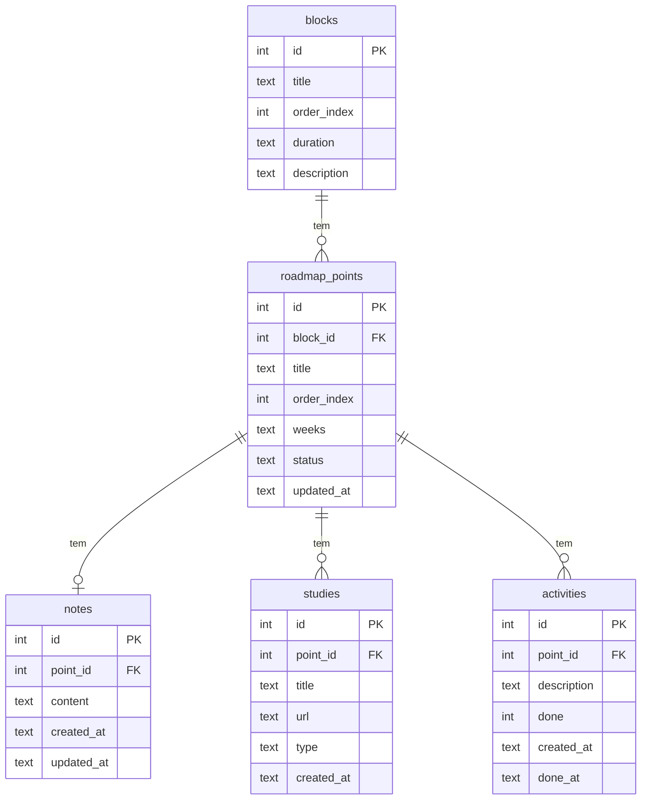

# Armazenamento e Persistência — Planejamento

## Tecnologia de Armazenamento

| Tecnologia | Uso |
|---|---|
| **SQLite** (via `better-sqlite3`) | Banco principal — todos os dados estruturados |
| **electron-store** | Configurações do usuário (preferências, tema, bloco atual) |
| **Arquivo .db local** | `%APPDATA%/StudyApp/studyapp.db` (Windows) |

> SQLite é ideal para apps off-line single-user: sem servidor, sem configuração, arquivo único, robusto e com excelente desempenho para dados na escala de um app de estudos pessoal.

---

## Estrutura das Tabelas

### `blocks` — Blocos do Currículo

```sql
CREATE TABLE blocks (
  id          INTEGER PRIMARY KEY,
  title       TEXT    NOT NULL,        -- ex: "Fundamentos da Web + Linguagem"
  order_index INTEGER NOT NULL UNIQUE, -- 1 a 8
  duration    TEXT,                    -- ex: "8–12 semanas"
  description TEXT
);
```

### `roadmap_points` — Pontos do Roadmap

```sql
CREATE TABLE roadmap_points (
  id          INTEGER PRIMARY KEY AUTOINCREMENT,
  block_id    INTEGER NOT NULL REFERENCES blocks(id),
  title       TEXT    NOT NULL,        -- ex: "JavaScript"
  order_index INTEGER NOT NULL,
  weeks       TEXT,                    -- ex: "05–08"
  status      TEXT    NOT NULL DEFAULT 'pending'
                CHECK(status IN ('pending','in_progress','done')),
  updated_at  TEXT    NOT NULL DEFAULT (datetime('now'))
);
```

### `notes` — Notas do Usuário

```sql
CREATE TABLE notes (
  id          INTEGER PRIMARY KEY AUTOINCREMENT,
  point_id    INTEGER NOT NULL REFERENCES roadmap_points(id) ON DELETE CASCADE,
  content     TEXT    NOT NULL DEFAULT '',   -- Markdown livre
  created_at  TEXT    NOT NULL DEFAULT (datetime('now')),
  updated_at  TEXT    NOT NULL DEFAULT (datetime('now'))
);
```

> Uma nota por ponto (UNIQUE em point_id) — simplificação para v1.

```sql
CREATE UNIQUE INDEX idx_notes_point ON notes(point_id);
```

### `studies` — Materiais de Estudo

```sql
CREATE TABLE studies (
  id          INTEGER PRIMARY KEY AUTOINCREMENT,
  point_id    INTEGER NOT NULL REFERENCES roadmap_points(id) ON DELETE CASCADE,
  title       TEXT    NOT NULL,
  url         TEXT,                    -- link externo (opcional)
  type        TEXT    NOT NULL DEFAULT 'text'
                CHECK(type IN ('text','link','video','book')),
  created_at  TEXT    NOT NULL DEFAULT (datetime('now'))
);
```

### `activities` — Atividades e Exercícios

```sql
CREATE TABLE activities (
  id          INTEGER PRIMARY KEY AUTOINCREMENT,
  point_id    INTEGER NOT NULL REFERENCES roadmap_points(id) ON DELETE CASCADE,
  description TEXT    NOT NULL,
  done        INTEGER NOT NULL DEFAULT 0,  -- 0 = false, 1 = true
  created_at  TEXT    NOT NULL DEFAULT (datetime('now')),
  done_at     TEXT                         -- preenchido quando done = 1
);
```

### `settings` (electron-store — JSON)

```json
{
  "theme": "dark",
  "lastViewedPointId": 3,
  "sidebarCollapsed": false,
  "fontSize": "md"
}
```

---

## Diagrama de Relacionamento (ERD)



---

## Fluxo de Informações

### Seed Inicial (dados pré-carregados)

Na primeira execução, o app popula o banco com os 8 blocos e seus pontos a partir de um arquivo `seed.ts` embutido no app:

```
Primeiro boot
   │
   ├─ db.exec(schema.sql)       → cria tabelas
   ├─ db.exec(seed.sql)         → insere blocos e pontos
   └─ electron-store.set(defaults)
```

### Leitura de Dados (Query Flow)

```
UI solicita dados
   │
   ├─ api.roadmap.getAll()
   │    └─ SELECT blocks JOIN roadmap_points
   │
   └─ api.notes.getByPoint(id)
        └─ SELECT * FROM notes WHERE point_id = ?
```

### Escrita de Dados (Write Flow)

```
Usuário interage
   │
   ├─ Marca ponto como "done"
   │    └─ UPDATE roadmap_points SET status='done', updated_at=NOW() WHERE id=?
   │
   ├─ Salva nota
   │    └─ INSERT OR REPLACE INTO notes(point_id, content, updated_at) VALUES(?,?,?)
   │
   ├─ Adiciona atividade
   │    └─ INSERT INTO activities(point_id, description) VALUES(?,?)
   │
   └─ Conclui atividade
        └─ UPDATE activities SET done=1, done_at=NOW() WHERE id=?
```

### Backup (Extras/v2)

Em futuras versões, o arquivo `.db` pode ser exportado manualmente pelo usuário via menu do app.
